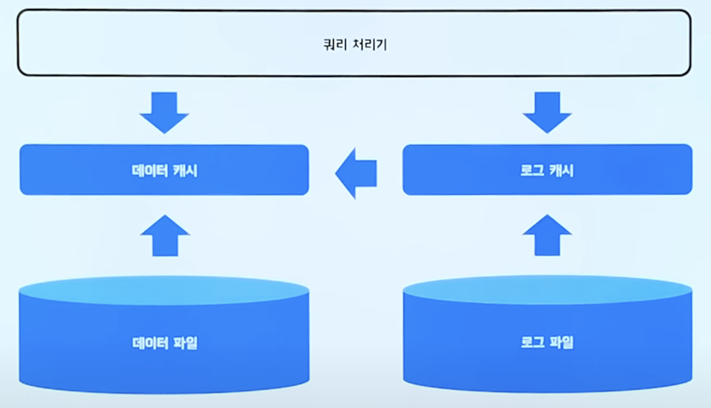

## [Index]

### 1. Index가 무엇이고, 왜 필요한지에 대해서 설명 해보실래요?

접기/숨기기

인덱스란 DB에서 table의 원하는 데이터를 조회하는데 있어서 성능 향상을 위해 사용하는 자료구조입니다.

인덱싱이 필요한 이유는 본질적으로 **검색 성능의 향상**에 있다고 보시면 되는데요, 
물론 검색 성능이 느려도 문제겠으나, 검색 성능이 지나치게 느린 경우 jvm의 경우 timeout 설정이 있는데 timeout 설정치를 넘도록 delay가 걸리는 경우
application에서는 오류를 일으킵니다.

### 2. Indexing을 위해서 사용하는 자료구조에 대해서 설명해보실래요?

접기/숨기기

첫번쨰로 Hash Table입니다. Hash Table의 경우 단일 데이터를 탐색하는데 투입되는 시간복잡도는 O(1)입니다. 위의 특징 때문에 Memory 기반의 DB (예를 들어 Redis)에서는 
Hash Table로 인덱스를 관리하게됩니다.

두번째로는 RDB에서는 B+, B- Tree 자료구조가 사용됩니다. O(1)의 복잡도를 가지는 Hash Table이 RDB에서도 유리하지 않을까라는 의문을 가지실수도 있으나, 탐색 쿼리는 
단일 데이터를 찾는 것만 이뤄지지 않고, **범위 탐색도 이뤄진다는 것을 고려해볼 필요가 있습니다.** Hash Table의 경우 단일 데이터를 찾아오는데 O(1)일수는 있겠으나, 여러개의 데이터를 찾는데는 여러번의 검색 쿼리를 
수행할 필요가 있기 때문에 성능 저하가 발생합니다.

따라서 시간복잡도가 O(logN)이지만 데이터 삽입, 삭제시 정렬이 된다는 특징을 가진 Binary Tree가 고려가 될수 있으나, Binary Tree의 경우 데이터의 패턴에 따라서 불균형이 발생할 가능성이 존재하기 때문에 
특정 데이터에 대해서는 성능이 높고, 특정 데이터에 대해서는 성능이 낮은 불균일한 탐색 성능을 제공할 우려가 있습니다.

따라서 데이터 삽입, 삭제가 일어나는 상황에서도 균형을 이루는 B+, B- Tree가 RDB에서는 인덱싱 자료구조로 채택됩니다.

### 3. Clustered Index 기법에 대해서 설명해보실래요?

접기/숨기기

Clustered Index는 인덱스에 저장된 데이터가 정렬되어 있다는 특징을 가집니다. 따라서 leaf page와 data page가 일치한다는 특징을 보이며, 
data가 정렬되어있다는 특징 덕분에 **Select절의 성능 향상을 기대할 수 있습니다.** 그러나, Data가 정렬되어있기 때문에 Create, Update, Delete 절에 대해서는
성능 저하가 발생하게됩니다. **(쉬운 예시만 보자면, 0~100번의 인덱스를 가지는 정렬된 배열이 있고, 중간에 순위가 50번째인 데이터가 삽입되는 상황을 생각해보면 됩니다. 50번째에 데이터를 삽입하면 이후의 데이터를 다 밀어야하기 때문에 성능은 끔찍할겁니다.)**

그리고 Clustered Index의 경우 data가 정렬되어있다는 특징 덕분에 캐시의 지역성으로 인해 Select절의 추가적인 성능 향상도 기대해볼 수 있는 특징도 존재합니다.

Clustered Index는 table당 하나만 존재가 가능하고, PK 제약조건을 사용하게 된다면 자동 생성이 된다는 특징을 가집니다. (다르게 말하면, Clustered Index는 PK를 위한 인덱싱 기법이라고 보시면 되겠습니다.)

### 4. Non-Clustered Index (Secondary Index)에 대해서 설명해보실래요?

접기/숨기기

Non-Clustered Index는 Clustered Index와는 다르게 데이터가 정렬되지 않는다는 특징을 가집니다. 정확하게 말하면, Leaf page는 정렬이 되지만, Data page는 정렬이 되지 않는겁니다.

그리고 Leaf page에서는 Data page의 주소를 각각 가지는 형태로 저장이 된다는것도 특징입니다.

위의 특징들로 인해서 Non-Clustered index는 Clustered Index에 비해서 Select 절의 성능이 낮다는 특징이 있으나, 나머지 Create, Update, Delete절에 대해서는 Clustered Index에 비해서 성능이 높게 측정되는 특징을 가집니다.

Non-clustered Index는 Unique 제약조건을 걸면 자동 생성된다는 특징이 있으며, Non-clustered Index는 한 테이블에 여러개가 동시에 존재 가능합니다. 
이러한 특성 덕분에 FK를 저장하기 위한 자료구조로도 활용이 됩니다.

### 5. Index 자료구조를 사용하면서 주의해야할 점을 들어주세요.

접기/숨기기

* Index는 별도의 자료구조이기 때문에 추가적인 저장공간을 요구합니다. 이는 대략 10% 정도로 알려져있습니다.
* Cardinality를 고려해야합니다. 예를 들어서, User table이 있고 인덱스로 gender라는 2짜리 cardinality를 가지는 애트리뷰트를 지정했다고 가정합니다. 그러면 gender를 통해 데이터를 조회하고도 depth를 늘려 추가 조회해야하는 상황이 발생합니다. 따라서 Index를 생성시 Cardinality가 높은 컬럼을 선정해서 채택하는게 좋습니다.
* Select를 제외한 쿼리들의 성능 하락을 유발하는 요소이기 때문에 데이터의 수정, 사입, 삭제가 자주 일어나는 애트리뷰트에 대해서는 인덱스를 적용 시 성능 하락이 발생할 수 있음을 깊이 새겨야합니다.
* 인덱싱은 본질적으로 Select절의 성능 향상에 목적을 두기 때문에, Where 절에서 자주 사용되는 컬럼인지 체크를 해줄 필요가 있습니다. 그렇지 않다면 Index를 적용할 이유가 없기 때문입니다.

> **추가적으로, 파레토의 법칙을 검색해서 알아보시면 좋습니다. 20%가 80%의 비지니스를 차지하게 된다는 법칙인데요, 이 법칙은 컴퓨터공학에서도 똑같이 적용되어 현실에서도 Command 쿼리보다는 조회 쿼리가 훨씬 많이 수행되게됩니다.**

## [Normalization]

### 6. 정규화에 대해서 설명해보실래요?

접기/숨기기

하나의 테이블에 대해서 여러개의 Entity의 애트리뷰트가 혼합될경우 data의 중복이 일어나거나, 혹은 그로 인해서 **갱신이상** 현상이 발생한다.

이를 해결하기 위해서 table을 쪼개는 방식으로 이상현상을 해결하는데, 이를 정규화라고 부른다.

* 실행이상: 원하지 않은 자료까지 한번에 저장이 되거나, 혹은 조회 쿼리 상에서 애트리뷰트를 모두 만족하지 못해서 조회가 되지 않는 등의 실행 과정에서 이상이 발생할 수 있다.
* 삭제이상: data를 삭제할 때 원치않은 데이터까지 한번에 삭제가 되는 이상 현상.
* 수정이상: 일부의 tuple만 갱신이 되어서 데이터에 일관성이 사라지거나, 혹은 데이터가 모호해지는 현상을 일컬음.

정규화 과정에 대해서는 다음 질문에서 답변을 드리겠습니다.

### 7. 정규화 과정에 대해서 아는대로 말씀해주세요.

접기/숨기기

1정규화부터 3정규화 까지만 설명하겠습니다. 아래의 과정은 직접 테이블을 분리하면서 경험해보는게 제일 좋습니다.

* 1정규화: Atomic을 보장하는 과정이다. 하나의 릴레이션에 대해서 여러 개의 상태를 가지는 경우 해당 릴레이션은 **원자성이 없다** 라고 부를 수 있는데, 1정규화는 이를 해결하는 과정입니다. 원자성을 해칠 여지가 있는 애트리뷰트를 선정해서 해당 애트리뷰트를 테이블 단위로 쪼개주면 1정규화가 이뤄집니다.
* 2정규화: Partial Dependencies를 해결하는 과정이다. Key에 대해서 종속성을 가지는 애트리뷰트가 하나의 릴레이션에서 존재할 수 있는데, Key에 대해서 종속성을 가지는 애트리뷰트들을 모두 묶어서 테이블 단위로 분리하는 것을 2정규화 과정이라고 부른다.
* 3정규화: Transitive Dependencies를 해결하는 과정이다. Key에 대해서 부분종속적인 애트리뷰트를 모두 분리하였더라도, 분리된 해당 테이블에서 이행 종속이 발생할 수 있다. 풀어서 말하자면, Key에만 의존하지 않고 특정 애트리뷰트가 또다른 애트리뷰트에 동시적으로 의존하는 경우가 있을 수 있다는 것이다. 이를 해결하기 위해서 이행 종속을 가지는 애트리뷰트를 모두 들어내서 테이블로 분리해주면 된다.

일반적으로는 1~3NF 까지만 만족해도 정규화를 잘 만족하였다고 보는 시각이 있습니다.

### 8. 정규화의 단점을 말씀해주세요.

접기/숨기기

정규화를 통해서 Anomaly를 해결할 수 있지만, 정규화를 하면할수록 table의 숫자가 늘어나기 때문에 **Join 연산이 증가합니다.**
 이로 인해서 성능 저하가 발생할 수 있기 때문에, 적당한 정규화 레벨에서 협상을 볼 필요가 있습니다.

## [Transaction]

### 9. 트랜잭션이 무엇인지에 대해서 간단하게 설명해주실래요?

접기/숨기기

트랜잭션이란 분리 불가능한 DB 작업의 최소 단위입니다.

DB에서는 DB 작업의 신뢰도를 높이기 위해 transaction에 ACID라는 속성을 만족하게끔 하는데, ACID의 의미는 다음과 같습니다.

* Atomacity(원자성): transaction의 모든 연산은 완벽하게 수행되거나, 혹은 하나라도 실패시 transaction의 모든 연산을 rollback 시켜서 애매한 경우를 만들어서는 안된다.
* Consistency(일관성): Transaction이 성공적으로 완료되면 DB의 transaction과 관련된 모든 칼럼들은 일관성을 유지해야한다. 예를 들면, 트랜잭션이 완료되면 금액 컬럼의 속성이 int에서 string으로 변하면 안되는 것 등이다.
* Isolation(고립성, 격리성): transaction은 각각 고립적으로 실행되야한다.
* Durability(영속성): transaction이 commit되면 해당 결과는 영원히 반영이 되어야한다. DB는 이를 위해서 transaction마다 log로 남겨서 보관한다.

### 10. 트랜잭션의 동작 원리에 대해서 설명해보실래요?

접기/숨기기

트랜잭션은 쿼리 처리기를 거쳐서 쿼리를 순차적으로 실행합니다.

실행될 트랜잭션 하나를 예시를 들어 설명드리겠습니다.

~~~SQL
BEGIN TRANSACTION 
UPDATE accounts SET balance = balance - 10000
WHERE user='buyer'
UPDATE accounts SET balance = balance + 10000
WHERE user='seller'
COMMIT TRANSACTION 
~~~

우선 트랜잭션이 처음 시작되는 시점에는 buyer에 대한 accounts 정보가 데이터 캐시에 없기 때문에  데이터 파일로부터 buyer의 accounts 정보를 가져와서 캐싱합니다. 그리고 balance에 10000을 뺀 결과를 데이터 캐시에 보관합니다.

그리고 동시에 로그캐시의 redo log, undo log를 갱신합니다. redo log, undo log에는 각각의 정보가 갱신됩니다.

* Redo log: 쿼리가 실행된 이후의 데이터 정보
* Undo log: 쿼리가 실행되기 이전의 데이터 정보

그리고 트랜잭션은 격리성 보장을 위해서 접근한 컬럼에 대해서 DB lock을 겁니다. 이에 대해서는 **고립성 보장** 섹션에서 자세하게 설명을 하도록 하겠습니다.

### 11. 트랜잭션의 동작 구조에 대해서는 잘 들었습니다. 그러면 트랜잭션은 ACID를 어떻게 보장하죠?

접기/숨기기

우선 원자성에 대해서 설명부터 해보겠습니다.

1️⃣ **원자성(Atomicity)**

위의 답변에서 DB는 트랜잭션 과정에서 Redo log, Undo log를 내부적으로 갱신한다고 설명드린 바 있습니다.

트랜잭션 수행 과정에서 Rollback이 일어나는 경우 DB는 Undo log의 내용을 순차적으로 읽어들여서 데이터 캐시를 undo log의 내용대로 재갱신합니다. 
이러한 과정으로 트랜잭션의 모든 연산을 취소시킬 수 있습니다.

트랜잭션 처리 과정에서 오류가 발생하였으나 트랜잭션을 복구해야하는 경우에는 Redo log를 읽어들여서 오류 발생 시점으로 돌리고, 그 이후의 연산을 계속 수행하면됩니다.

2️⃣ **격리성(Isolation)**

DB는 각각의 트랜잭션의 고립을 보장하기 위해서 DB Lock을 수행합니다.

그런데 고려할게 있습니다. **DB도 하나의 프로세스이기 때문에 문맥교환의 영향에서 벗어나질 못합니다.** 따라서 트랜잭션 수행 간에 문맥교환으로 인해서 lock의 순서가 꼬이게된다면 **Deadlock에 빠질 위험이 존재합니다.**

따라서 DB는 2PL 프로토콜(2 Phase-Locking Protocol)을 이용해서 Lock에 대한 단계를 나눕니다. 

* 상승 페이즈(Growing Phase): Exclusive Lock(배타적인 락), Shared Lock(공유 락)을 수행하는 페이즈입니다.
* 하강 페이즈(Shirinking Phase): Unlock을 수행하는 페이즈입니다.

DB는 이를 락킹 스케쥴러로 관리하여 상승 페이즈와 하강페이즈의 락이 섞이지 않도록 방지해줍니다.

따라서 DB는 스케쥴러의 영향을 받더라도 Lock이 꼬이는 것으로 인해 데드락에 빠질 위험 부담을 줄이면서 Transaction의 고립성을 보장해줄 수 있습니다.

3️⃣ **영속성(Durability)**

DB는 커밋된 트랜잭션에 대해서 로그를 보관합니다. 따라서 DB에 이상이 발생하더라고 해당 로그를 통해서 트랜잭션의 결과를 복구시킬 수 있습니다. 
이를 통해서 DB는 커밋된 트랜잭션에 대한 영속성을 보장해줄 수 있습니다.

### 12. 트랜잭션을 사용할 때 주의할 점이 있을까요?

접기/숨기기

해당 질문에서 면접관이 면접자의 경험이나 지식을 딥하게 알아볼 수 있을것 같습니다. 이 질문에서는 다른 답변자와 차별점을 두도록 합시다.

정석적인 대답은, **한 트랜잭션에 많은 쿼리를 수행하지 말자** 입니다.

위의 대답은 너무 교과서적인 답변이기 때문에, 저같으면 아래의 부연 설명을 통해서 차별점을 둘것 같습니다.

보통 저희같은 백엔드 개발자는 DB에 직접 접근해서 트랜잭션을 수행할 일은 없고, **톰캣같은 웹서버를 통해서 들어온 요청에 대해서 WAS 상의 애플리케이션에게 DB와의 소통을 위임합니다.**

그리고 WAS 애플리케이션은 동작할 때 미리 DB와의 커넥션을 쓰레드 단위로 맺어둡니다. 커넥션을 10개 정도 맺는다고 가정해보겠습니다.

모든 쿼리당 처리 속도가 300ms가 걸린다고 가정하고, A라는 트랜잭션에는 이러한 쿼리가 20개 담겨있다고 가정해보겠습니다. 그러면 해당 트랜잭션은 대략 6초동안 해당 커넥션을 점유하는 셈이 되고, 
이후의 들어오는 트랜잭션도 DB와의 소통을 위해서 커넥션을 요구하는 상황이 될겁니다.

그러면 아래와 같은 문제점들이 발생할겁니다.

* 클라이언트가 날린 Req에 대해서 Res가 6초가 넘도록 안 돌아오는 상황이 발생합니다. (WAS에서도 연산 해야되니까 6초보다 길어지겠죠?) 대한민국 사람들은 2~3초 동안 반응이 없으면 무조건 F5를 눌러서 또 다른 Req를 생성해버립니다. 그러면 해당 클라이언트는 고객에서 Ddos 공격자로 변신해서 해당 서버를 공격하게 될겁니다.
* DB의 커넥션풀은 한정적입니다. 계속 트랜잭션이 커넥션을 점유한다면, 다른 요청이 새로운 커넥션을 요청할거고, 그렇게 되면 DB의 커넥션풀이 고갈될겁니다. 즉, DB에 병목 현상이 벌어진다는 소리입니다.

그런데 어쩔수없이 한 트랜잭션에 어쩔수없이 많은 쿼리를 욱여넣어야할 경우도 분명히 있을겁니다. 그럴 때는 DB 자체 차원에서 해결하기 보다는, DB를 Master, Slave 구조로 분산을 시킨다거나, 혹은 쓰기전용 DB를 RDBMS로 두고, 읽기 전용 DB를 Redis라던가 그런 식으로 두어서 쓰로풋을 높여 DB 차원에서 벌어지는 병목을 줄일 수 있을것 같습니다.

혹은 CQRS 패턴을 도입하여 WAS 차원에서의 커넥션 개수를 줄여서 DB의 병목을 줄임으로써 트랜잭션에 많은 쿼리가 있더라도 처리 속도를 높이는 방법도 고려해볼 수 있을것 같습니다.

이 이상의 자세한 설명은 생략하겠습니다.

***

### 👉 Reference

[찰리의 인덱싱 (10분 테코톡)](https://www.youtube.com/watch?v=P5SZaTQnVCA)

[에이든의 트랜잭션 메커니즘 (10분 테코톡)](https://www.youtube.com/watch?v=ImvYNlF_saE)

[DB 커넥션풀의 용도를 묻는 질문의 숨은 의도 (널널한 개발자)](https://www.youtube.com/watch?v=NMt9wgRsnjw)