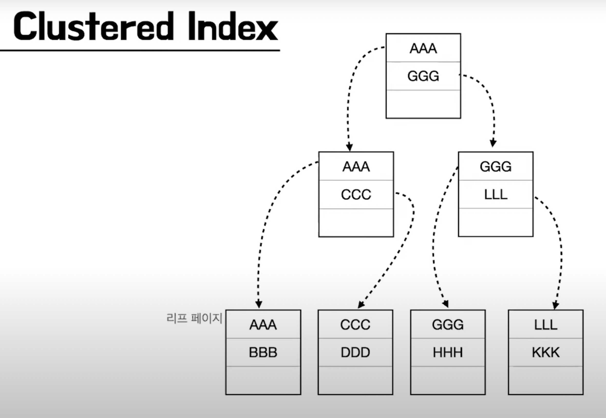
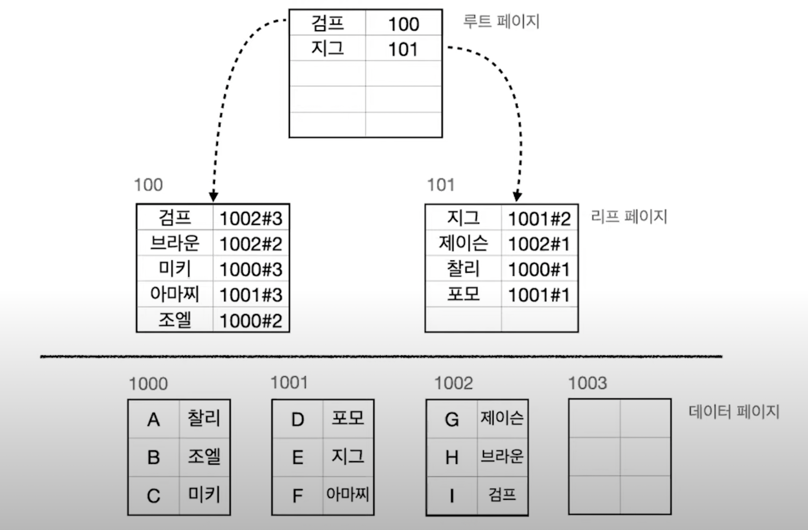

## [Index]

***

### 1. Index가 무엇이고, 왜 필요한지에 대해서 설명 해보실래요?

접기/숨기기

인덱스란 DB에서 table의 원하는 데이터를 조회하는데 있어서 성능 향상을 위해 사용하는 자료구조입니다.

인덱싱이 필요한 이유는 본질적으로 **검색 성능의 향상**에 있다고 보시면 되는데요, 
물론 검색 성능이 느려도 문제겠으나, 검색 성능이 지나치게 느린 경우 jvm의 경우 timeout 설정이 있는데 timeout 설정치를 넘도록 delay가 걸리는 경우
application에서는 오류를 일으킵니다.

### 2. Indexing을 위해서 사용하는 자료구조에 대해서 설명해보실래요?

접기/숨기기

첫번쨰로 Hash Table입니다. Hash Table의 경우 단일 데이터를 탐색하는데 투입되는 시간복잡도는 O(1)입니다. 위의 특징 때문에 Memory 기반의 DB (예를 들어 Redis)에서는 
Hash Table로 인덱스를 관리하게됩니다.

두번째로는 RDB에서는 B+, B- Tree 자료구조가 사용됩니다. O(1)의 복잡도를 가지는 Hash Table이 RDB에서도 유리하지 않을까라는 의문을 가지실수도 있으나, 탐색 쿼리는 
단일 데이터를 찾는 것만 이뤄지지 않고, **범위 탐색도 이뤄진다는 것을 고려해볼 필요가 있습니다.** Hash Table의 경우 단일 데이터를 찾아오는데 O(1)일수는 있겠으나, 여러개의 데이터를 찾는데는 여러번의 검색 쿼리를 
수행할 필요가 있기 때문에 성능 저하가 발생합니다.

따라서 시간복잡도가 O(logN)이지만 데이터 삽입, 삭제시 정렬이 된다는 특징을 가진 Binary Tree가 고려가 될수 있으나, Binary Tree의 경우 데이터의 패턴에 따라서 불균형이 발생할 가능성이 존재하기 때문에 
특정 데이터에 대해서는 성능이 높고, 특정 데이터에 대해서는 성능이 낮은 불균일한 탐색 성능을 제공할 우려가 있습니다.

따라서 데이터 삽입, 삭제가 일어나는 상황에서도 균형을 이루는 B+, B- Tree가 RDB에서는 인덱싱 자료구조로 채택됩니다.

### 3. Clustered Index 기법에 대해서 설명해보실래요?

접기/숨기기

Clustered Index는 인덱스에 저장된 데이터가 정렬되어 있다는 특징을 가집니다. 따라서 leaf page와 data page가 일치한다는 특징을 보이며, 
data가 정렬되어있다는 특징 덕분에 **Select절의 성능 향상을 기대할 수 있습니다.** 그러나, Data가 정렬되어있기 때문에 Create, Update, Delete 절에 대해서는
성능 저하가 발생하게됩니다. **(쉬운 예시만 보자면, 0~100번의 인덱스를 가지는 정렬된 배열이 있고, 중간에 순위가 50번째인 데이터가 삽입되는 상황을 생각해보면 됩니다. 50번째에 데이터를 삽입하면 이후의 데이터를 다 밀어야하기 때문에 성능은 끔찍할겁니다.)**

그리고 Clustered Index의 경우 data가 정렬되어있다는 특징 덕분에 캐시의 지역성으로 인해 Select절의 추가적인 성능 향상도 기대해볼 수 있는 특징도 존재합니다.

Clustered Index는 table당 하나만 존재가 가능하고, PK 제약조건을 사용하게 된다면 자동 생성이 된다는 특징을 가집니다. (다르게 말하면, Clustered Index는 PK를 위한 인덱싱 기법이라고 보시면 되겠습니다.)

### 4. Non-Clustered Index (Secondary Index)에 대해서 설명해보실래요?

접기/숨기기

Non-Clustered Index는 Clustered Index와는 다르게 데이터가 정렬되지 않는다는 특징을 가집니다. 정확하게 말하면, Leaf page는 정렬이 되지만, Data page는 정렬이 되지 않는겁니다.

그리고 Leaf page에서는 Data page의 주소를 각각 가지는 형태로 저장이 된다는것도 특징입니다.

위의 특징들로 인해서 Non-Clustered index는 Clustered Index에 비해서 Select 절의 성능이 낮다는 특징이 있으나, 나머지 Create, Update, Delete절에 대해서는 Clustered Index에 비해서 성능이 높게 측정되는 특징을 가집니다.

Non-clustered Index는 Unique 제약조건을 걸면 자동 생성된다는 특징이 있으며, Non-clustered Index는 한 테이블에 여러개가 동시에 존재 가능합니다. 
이러한 특성 덕분에 FK를 저장하기 위한 자료구조로도 활용이 됩니다.

### 5. Index 자료구조를 사용하면서 주의해야할 점을 들어주세요.

접기/숨기기

* Index는 별도의 자료구조이기 때문에 추가적인 저장공간을 요구합니다. 이는 대략 10% 정도로 알려져있습니다.
* Cardinality를 고려해야합니다. 예를 들어서, User table이 있고 인덱스로 gender라는 2짜리 cardinality를 가지는 애트리뷰트를 지정했다고 가정합니다. 그러면 gender를 통해 데이터를 조회하고도 depth를 늘려 추가 조회해야하는 상황이 발생합니다. 따라서 Index를 생성시 Cardinality가 높은 컬럼을 선정해서 채택하는게 좋습니다.
* Select를 제외한 쿼리들의 성능 하락을 유발하는 요소이기 때문에 데이터의 수정, 사입, 삭제가 자주 일어나는 애트리뷰트에 대해서는 인덱스를 적용 시 성능 하락이 발생할 수 있음을 깊이 새겨야합니다.
* 인덱싱은 본질적으로 Select절의 성능 향상에 목적을 두기 때문에, Where 절에서 자주 사용되는 컬럼인지 체크를 해줄 필요가 있습니다. 그렇지 않다면 Index를 적용할 이유가 없기 때문입니다.

> **추가적으로, 파레토의 법칙을 검색해서 알아보시면 좋습니다. 20%가 80%의 비지니스를 차지하게 된다는 법칙인데요, 이 법칙은 컴퓨터공학에서도 똑같이 적용되어 현실에서도 Command 쿼리보다는 조회 쿼리가 훨씬 많이 수행되게됩니다.**

## [Normalization]

***

### 6. 정규화에 대해서 설명해보실래요?

접기/숨기기

하나의 테이블에 대해서 여러개의 Entity의 애트리뷰트가 혼합될경우 data의 중복이 일어나거나, 혹은 그로 인해서 **갱신이상** 현상이 발생한다.

이를 해결하기 위해서 table을 쪼개는 방식으로 이상현상을 해결하는데, 이를 정규화라고 부른다.

* 실행이상: 원하지 않은 자료까지 한번에 저장이 되거나, 혹은 조회 쿼리 상에서 애트리뷰트를 모두 만족하지 못해서 조회가 되지 않는 등의 실행 과정에서 이상이 발생할 수 있다.
* 삭제이상: data를 삭제할 때 원치않은 데이터까지 한번에 삭제가 되는 이상 현상.
* 수정이상: 일부의 tuple만 갱신이 되어서 데이터에 일관성이 사라지거나, 혹은 데이터가 모호해지는 현상을 일컬음.

정규화 과정에 대해서는 다음 질문에서 답변을 드리겠습니다.

### 7. 정규화 과정에 대해서 아는대로 말씀해주세요.

접기/숨기기

1정규화부터 3정규화 까지만 설명하겠습니다. 아래의 과정은 직접 테이블을 분리하면서 경험해보는게 제일 좋습니다.

* 1정규화: Atomic을 보장하는 과정이다. 하나의 릴레이션에 대해서 여러 개의 상태를 가지는 경우 해당 릴레이션은 **원자성이 없다** 라고 부를 수 있는데, 1정규화는 이를 해결하는 과정입니다. 원자성을 해칠 여지가 있는 애트리뷰트를 선정해서 해당 애트리뷰트를 테이블 단위로 쪼개주면 1정규화가 이뤄집니다.
* 2정규화: Partial Dependencies를 해결하는 과정이다. Key에 대해서 종속성을 가지는 애트리뷰트가 하나의 릴레이션에서 존재할 수 있는데, Key에 대해서 종속성을 가지는 애트리뷰트들을 모두 묶어서 테이블 단위로 분리하는 것을 2정규화 과정이라고 부른다.
* 3정규화: Transitive Dependencies를 해결하는 과정이다. Key에 대해서 부분종속적인 애트리뷰트를 모두 분리하였더라도, 분리된 해당 테이블에서 이행 종속이 발생할 수 있다. 풀어서 말하자면, Key에만 의존하지 않고 특정 애트리뷰트가 또다른 애트리뷰트에 동시적으로 의존하는 경우가 있을 수 있다는 것이다. 이를 해결하기 위해서 이행 종속을 가지는 애트리뷰트를 모두 들어내서 테이블로 분리해주면 된다.

일반적으로는 1~3NF 까지만 만족해도 정규화를 잘 만족하였다고 보는 시각이 있습니다.

### 8. 정규화의 단점을 말씀해주세요.

접기/숨기기

정규화를 통해서 Anomaly를 해결할 수 있지만, 정규화를 하면할수록 table의 숫자가 늘어나기 때문에 **Join 연산이 증가합니다.**
 이로 인해서 성능 저하가 발생할 수 있기 때문에, 적당한 정규화 레벨에서 협상을 볼 필요가 있습니다.

***

### 👉 Reference

[찰리의 인덱싱 (10분 테코톡)](https://www.youtube.com/watch?v=P5SZaTQnVCA)