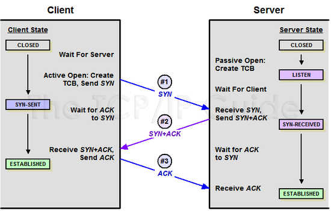
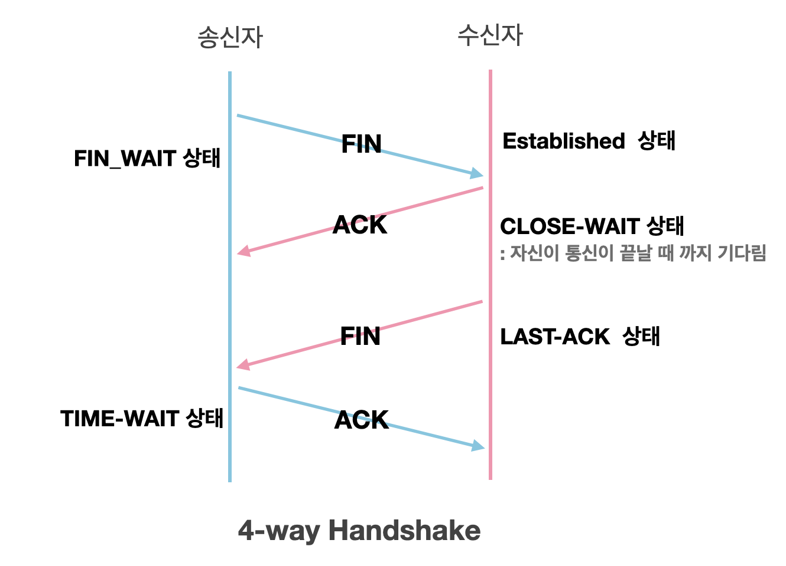

## [TCP]

### 1. TCP에 대해서 설명해주실래요?

접기/숨기기

TCP는 데이터 전송/수신의 신뢰성을 보장하기 위한 전송계층의 연결지향형 프로토콜입니다.

TCP는 데이터의 신뢰성을 보장하기 위해서 대표적으로 아래의 4가지를 수행합니다.

* Segment마다 sequence number를 부여하여 데이터의 순서성을 보장합니다.
* Congestion Control을 이용해서 Network의 혼잡도를 고려하여 Sender의 Congestion window size를 조절함으로써 송신 속도를 제어합니다.
* Flow Control을 이용해서 Receiver측의 receive buffer 사이즈를 고려하여 Sender측의 송신 속도를 제어합니다.
* Segment의 Checksum field를 검증하여 해당 Segment에 비트에러가 없는지 검증합니다.

### 2. TCP의 3-way handshaking 과정에 대해서 설명해주실래요?

접기/숨기기

1. Client 측에서는 Server 측에 **SYN field**가 1로 채워진 segment를 전송합니다.
2. Server는 client 측으로부터 SYN Segment를 수신받으면 SYN+ACK segment를 client측에 송신합니다. 
그리고 state를 SYN_RECEIVED로 전환하고 Server 내부의 SYN Backlog Queue에 client측이 송신한 syn 정보를 저장해둡니다. 그리고 일정 시간동안 해당 syn이 해소되지 않으면 SYN+ACK을 재전송합니다.
특정 횟수동안 queue 내부의 SYN이 해소되지 않으면 해당 SYN을 expire시킵니다.
3. Client가 SYN+ACK을 수신하면 Server에 ACK을 전송합니다. 이 때 Server는 ACK에 대응하는 SYN을 SYN Backlog Queue를 탐색하여 expire시킵니다.

* 3-way handshaking 과정에서 Client, Server는 각각의 Sequence Number를 동시에 주고받습니다. 데이터의 시작점을 정확하게 알려야하니까요.
* Client는 마지막 ACK Segment에 Packet을 채워서 보낼 수 있습니다. 이를 piggy-bagging이라고 부릅니다.

### 2-1. 위에서 설명한 3-way handshaking에는 취약점이 존재하는데 눈치채셨나요? (심화적인 내용입니다. 건너뛰셔도 무방합니다.) 

접기/숨기기

위의 전통적인 TCP 3-way handshaking 과정에서는 2가지의 문제점을 발견할 수 있습니다.

* DOS, DDOS **(Distributed DOS Attack)** 공격에 취약점을 가잡니다. (특히, SYN Flood Attack에 취약점을 가집니다.)
* 대용량 아키텍처를 운영하는 경우, 하나의 Cluster가 fallover 상태에 빠졌다가 recovery 될 때 fallback 과정에서 의도치않은 SYN Flood 현상을 받을 수 있습니다.

특히나 두번째 취약점 사례의 경우 대용량  아키텍처를 운영하는 가운데서 Kafka Cluster의 리커버리 과정에서 겪을수도 있는 문제입니다. **(실제로도 NHN측에서 이 현상으로 인해 고생을 했던적이 있다고 하기도하구요.)**

첫번째 사례의 경우 악의적인 사용자가 자신의 IP를 스푸핑해서 Server측에 SYN Segment만 전송하게 될 시, 서버측에서는 SYN Backlog Queue에 해당 SYN을 계속해서 적재하게됩니다. 
그 과정에서 Server측에서는 **SYN Backlog Queue 오버플로우** 현상을 발생시키게 되고, 이는 서비스 장애로 직결합니다.

해결 방식은 두가지입니다.

1. 운영중인 서버 가상머신에서 SYN Cookie 설정을 1로 설정합니다. 그렇게되면 SYN Backlog Queue가 비활성화되고, 대신에 SYN+ACK에서 SYN Cookie를 실어서 전송하게됩니다. 그리고 이를 수신한 Client는 ACK에 SYN Cookie를 같이 실어서 전송해야합니다.
2. 1번 방식에 더하여, Client와 Server의 가운데에 DDOS 방어장비를 설치합니다. 해당 장비는 신뢰가능한 SYN을 필터하여 SYN Proxy를 Server측에 전송합니다.

그러나 2번의 방식도 완벽하지는 않습니다. 아직도 DDOS 공격의 50%는 SYN Flood Attack이 주류를 이루니까요. 결국 Server는 SYN Proxy를 받더라도 SYN+ACK을 전송해야한다는 사실은 변함이 없고, DDOS 물량이 DDOS 방어장비의 수준을 넘어버리면 결국 서비스가 뻗을수밖에 없습니다.

그러나 1번의 방식만으로는 대용량 아키텍처에서 SYN Backlog Queue 오버플로우 현상에서는 자유로워질수는 있을걸로 기대합니다. SYN+ACK, ACK에 SYN Cookie를 실어야한다는 점에서 오버헤드가 발생할수는 있으나, 연결 단계에서 지연을 겪는게 낫지, Cluster의 장애가 다시 발생하는것보다는 낫다고 판단됩니다.

### 3. 4-way handshaking 과정에 대해서 설명해주실래요? 

접기/숨기기

1. Client는 FIN Segment를 보냅니다.
2. Server는 FIN을 수신받으면 ACK을 전송합니다.
3. Server는 ACK을 전송한 뒤에 일정 시간이 지난 후 FIN Segment를 Client에 전송합니다. Server측에서 아직 덜 전송한 Segment가 존재할 수 있기 때문입니다.
4. Client는 Server측의 FIN을 수신하면 ACK Segment를 전송하여 연결을 끊습니다.

### 3. TCP의 Flow Control에 대해서 설명해주실래요? 

접기/숨기기

Receiver측이 Segment를 수신할 때 마다 자신의 rwnd **(Receive window size)** 를 피드백 해줌으로써 Sender가 이를 참조하여 송신하는 window의 사이즈를 조절하는 기법이다.

TCP는 파이프라이닝 기법을 이용해서 In-flight Packet을 window size만큼 보내는데, ACK이 돌아오는대로 window를 옮기는 **Slide Window** 방식으로 효율적인 데이터 전송을 합니다. 

### 4. TCP의 Congestion Control에 대해서 설명해주실래요? 

접기/숨기기

Congestion Control은 Sender측이 현재 Network의 혼잡도를 고려하여 자신의 Congestion Window 사이즈를 조절하여 송신 패킷의 양을 조절하는 기법이다.

Congestion Control은 3개의 단계로 나누어지며, 이를 이해하기 위해서는 아래의 사전지식이 필요합니다.

* Accumulative ACKs: TCP는 데이터의 신뢰성을 보장하기 위해서 ACK을 누적 방식으로 주고받습니다. 이를 이용해서 네트워크의 장애를 탐지합니다.
* Duplicated ACKs: 같은 Seq num을 가지는 ACK이 중복되어서 수신되는 현상을 일컫습니다. TCP는 Accumulative ACK 정책을 따르기 때문에 ACK이 중복되어 발생하였다는 것은, 중간에 네트워크의 혼잡이 발생하였다는 뜻입니다. 일반적으로 3개의 중복 ACK이 발생하면 네트워크가 혼잡하다고 판단합니다.
* ssthresh: 임계치를 뜻합니다.

그러면 단계별로 설명을 드리겠습니다.

1. SS **(Slow Start)** : Congestion window size가 ssthresh에 도달할 때 까지 기하급수적으로 늘리는 단계입니다. 매번 cwnd를 2배로 올리는 단계입니다. 여기서 장애를 겪게되면 ssthresh를 절반으로 깎고 cwnd를 1로 초기화하고 SS를 다시 시작합니다.
2. Congestion Avoidance: cwnd가 ssthresh를 넘어서면 자신의 cwnd를 선형적으로 증가시키는 단계입니다. 일반적으로 window size를 매 타임마다 1씩 증가시킵니다. 
Congestion Avoidance 단계에서 장애가 발생시 두 가지의 선택지가 존재합니다.
* Fast Retransmission: 3-duplicated ACK이 Congestion Control 단계에서 벌어질 시 진입하는 단계입니다. 그저 네트워크가 혼잡하기 때문에 벌어진 현상이기 때문에 자신의 cwnd를 절반으로 깎고 cwnd를 증가시키면서 빠르게 장애복구를 하는 단계입니다.
* Slow Start 단계로 되돌아간다: Congestion Avoidance 단계에서 timeout이 발생할 시 선택하게되는 단계입니다. 이 때 ssthresh는 절반으로 깎고, cwnd는 1로 초기화되어서 처음부터 다시 시작합니다.

3. Fast Recovery: 위에서 설명한 그대로입니다. 3-duplicated ACK이 발생할 시 진입하는 단계입니다.

이 때 TCP는 Flow Control로 받은 rwnd 정보와 Congestion Control로 얻은 cwnd를 조합하여 자신의 송신 사이즈를 결정합니다. 일반적으로 min(cwnd, rwnd)로 결정합니다.

## [UDP]

### 5. UDP는 무엇인지 설명해주실수 있나요? 

접기/숨기기

UDP는 TCP와는 다르게 **비연결지향형** 의 전송계층 프로토콜입니다. 다른 말로 Best-effort Protocol 이라고도 불립니다.

UDP가 가지는 특성은 다음과 같습니다.

* Flow/Congestion Control 과정이 없다. 즉, 신뢰성이 없는 프로토콜이다.
* 데이터를 Datagram 단위로 전송한다.
* 그래도 Checksum을 이용해서 Error Detection은 수행한다.

UDP는 TCP와는 다르게 신뢰성을 가지지 않고 데이터를 전송하기 때문에 Transport layer에서 에러를 해결하지 않습니다. 따라서 상위 계층인 application layer에서 잘못된 데이터에 대한 해결을 해야하는 불편함이 존재합니다.

### 6. UDP는 어디서 사용하는지 사례를 간단하게 들어주세요. 

접기/숨기기

UDP는 신뢰성을 보장하기 어려운 프로토콜이지만, 비연결지향이라는 점에서
1. 전송만 하고 피드백을 받지않아도 되는 서비스
2. 신뢰성이 굳이 필요가 없는 서비스

에서 사용이 됩니다.

사례를 들자면 다음과 같습니다.

* ICMP: 인터넷 제어 메시지 프로토콜로, OS 상에서 오류메시지를 주고받는데 주로 사용되는 프로토콜이다.
* DNS: Domain Name Service로, 주어진 Domain Name과 주어진 IP를 상호치환하는데 사용하는 서비스입니다. 이 서비스에 대해서는 Client가 굳이 연결을 맺을 이유가 없기 때문에 UDP로 주로 서비스됩니다. 그러나, DNS도 UDP 전송 사이즈 제한을 넘게되면 TCP를 사용하는 경우가 간혹 있습니다.

### (참고) QUIC 프로토콜 

접기/숨기기

최근에 Google에서 2015년에 발표한 전송계층의 프로토콜입니다. UDP를 기반으로 만들어냈으나, UDP와는 아래의 차이점을 보입니다.

* UDP와는 다르게 3-way handshaking 과정이 존재합니다. 그러나 TCP와의 3-way handshaking 과정에 차이가 있는데, TCP의 3-way handshaking은 마지막 ACK 에서만 piggy-bagging이 가능했으나, 
QUIC의 3-way handshaking은 처음 단게부터 데이터를 piggy-bagging 할 수 있습니다. 따라서 성능이 높습니다.
* 매번 3-way handshaking을 통해서 커넥션을 맺는 것이 아니라 **커넥션 정보를 캐싱하여 커넥션이 필요할 때 마다 꺼내쓰는 방식입니다.** 따라서 3-way handshaking으로 인한 오버헤드가 줄어듭니다.
* 독립 스트림이 아닌 **멀티 스트림**을 기반으로 Datagram을 전송합니다. 따라서 기존의 TCP의 경우 **단일 스트림에서 데이터가 손실되면 바로 리커버리에 들어가는 반면, QUIC은 멀티 스트림 환경에서 동작하기 때문에 한 스트림에서 문제가 생기면 다른 스트림은 별개이기 때문에 성능이 높습니다.**

그리고 현재 Google은 이러한 QUIC 프로토콜을 이용해서 자사 서비스에 HTTP/3.0을 도입하였습니다.

## [www.google.com을 검색하면 벌어지는 일]

### 7. **www.google.com** 을 검색하면 벌어지는 일을 최대한 설명해보세요.  

접기/숨기기

우선 HTTP, TCP/IP, Ethernet을 이용한다고 가정하겠습니다. 그리고 중간에 프록시 서버또한 없다는 가정하에 설명을 드리도록 하겠습니다.

첫번째로 해야할 일은, 3-way handshaking 과정을 통해서 저의 컴퓨터와 구글 서버 간에 커넥션을 맺어야합니다. 그러기 위해서 저의 컴퓨터에서는 저의 컴퓨터 포트, IP, MAC 주소 그리고 구글 서버의 포트, IP, MAC 주소가 필요합니다.

저의 컴퓨터 정보는 제 컴퓨터가 스스로 잘 알고있기 때문에 생략하고(사실 자신의 IP도 DHCP를 통해 받아야하지만, 생략하겠습니다), 구글 서버의 포트는 80번으로 well-known 이기 때문에 알아야할 정보는 구글 서버의 IP 주소와 MAC 주소입니다.

우선 구글 서버의 IP부터 찾아야합니다. OS에 DNS 캐시부터 일단 뒤져서 구글 서버의 DNS가 캐시가 되어있는지부터 검사합니다. 만일 캐시된 정보가 있다면 해당 DNS 캐시에서 IP 주소를 따와서 IP Header에 넣어주고, 만일 없다면 우선 DNS를 통해 구글 서버의 IP를 찾아와야합니다.

DNS 서비스의 경우 UDP 기반입니다. 따라서 별도의 커넥션 과정은 없으며 바로 http 요청을 이용해서 데이터를 가져오면 됩니다.

DNS에서 구글 서버의 IP를 가져오는데 성공하였다면, 이 정보를 이용하여 IP 헤더에 해당 IP 주소를 목적지 IP에 채웁니다.

ARP 프로토콜을 이용해서 자신의 컴퓨터 공유기의 MAC 주소를 알아냈다면, 해당 request를 공유기를 통해서 밖으로 내보내면 됩니다. 이 과정에서 자신의 컴퓨터는 private ip를 사용하고있는 입장이기 때문에 NAT를 통해서 공인 ip로 치환한 다음에 밖으로 보내게 됩니다.

그리고 라우터를 떠도는 해당 요청은 구글 서버에 도달하기 전에 ARP 프로토콜을 이용해서 구글 서버의 MAC 주소를 취득한 다음에 구글 서버의 application layer까지 요청이 올라간 다음 구글 서버에서는 SYN + ACK을 저의 컴퓨터로 보냅니다. 이 과정은 지금까지 해왔던 과정의 역순입니다.

이러한 일련의 과정을 통해서 저의 컴퓨터와 구글 서버 간의 커넥션이 맺어졌다면 html 파일을 구글 서버측에 요청합니다. 이 때도 이전에 시행하였던 과정의 반복입니다.

구글 서버측에서 html 파일을 response에 실어서 보냈다면, 이를 저의 컴퓨터에서 받고난 다음, 4-way handshaking 과정을 통해서 커넥션을 끊습니다.

> **만일 Proxy Server가 있다는 가정을 깔게된다면 제 컴퓨터에서 쏘아진 request는 구글 서버에 도달하는 것이 아닌, 프록시 서버로 도달합니다. 그리고 프록시 서버에 원하는 요청이 존재하는지 확인한 다음, 없다면 프록시 서버에서 구글 서버로 요청을 날려서 html을 취득한 다음, 그것을 다시 저의 컴퓨터로 전송하는 방식이 될겁니다.**

## [HTTP]

### 8. HTTP/0.9, HTTP/1, HTTP/1.1, HTTP/2 에 대해서 설명해주실래요?

접기/숨기기

1. **HTTP/0.9**

HTTP/0.9는 HTTP의 초기 버전입니다. Body는 무조건 html을 이용해서 통신을 해야했으며, 1개의 요청이 처리되면 tcp 커넥션이 끊어지는 방식으로 동작하였습니다.

2. **HTTP/1.0**

HTTP/0.9에서 약간 개선되었습니다. Http Header라는 것이 새로 생겨서 이제는 Body를 다양하게 수신할 수 있게 되었습니다.

그러나 하나의 TCP 커넥션 당 1개의 리퀘스트만을 처리할 수 있다는 점을 달라진게 없습니다.

3. **HTTP/1.1**

이제는 1개의 TCP 커넥션 당 1개 이상의 리퀘스트를 처리할 수 있도록 개선되었습니다. TCP처럼 **타임아웃** 이라는 것을 두어서, 하나의 커넥션에서 request간의 간격이 타임아웃이 이내이면 request를 해당 커넥션을 이용해서 계속 처리할 수 있습니다.

그리고 해당 프로토콜 버전부터 TCP에서 지원하던 파이프라이닝 기법이 HTTP 에서도 적용이 되기 시작하였습니다. 따라서 HTTP의 성능이 매우 향상되었습니다.

그러나 HTTP/1.1에도 문제는 크게 두 가지가 있었습니다.

* 파이프라이닝을 통해서 전달되는 여러 요청이 공통된 헤더를 가진 경우, 해당 헤더의 반복을 묵인하고 전달한다는 것입니다. 이는 오버헤드를 불러일으킵니다.
* 파이프라이닝을 수행하기는 하지만, 독립 스트림에서 이뤄집니다. 따라서 선행되는 요청에 블락이 걸리면 뒤의 요청의 처리가 미뤄지는 **Line of Blocking** 현상이 발생했습니다.

4. **HTTP/2.0**

HTTP/2.0에서는 위의 두 가지 문제가 어느 정도 해결되었습니다. 바로 아래의 특징 덕분입니다.

* HTTP의 헤더와 바디를 분리해서 전송하는게 가능해졌습니다.
* 기존의 HTTP/1.1 까지는 플레인 텍스트를 통해서 전달이 되었습니다. 그러나 HTTP/2.0 부터는 플레인 텍스트가 아닌 바이너리 텍스트로 변환되어 전달되기 때문에 속도의 성능이 향상되었습니다.
* 공통된 헤더에 대해서는 헤더를 압축해서 전달하는게 가능해졌습니다. 따라서 오버헤드가 줄어들었습니다.
* 헤더와 바디가 분리되어 있다보니 다른 요청이 또다른 요청 사이에 끼어드는 것이 가능해졌습니다. 그리고 수신자 측에서는 이를 de-multiplexing 하여 처리를 하면 되기 때문에 Line of Blocking이 해결되었습니다.
* Server push 기능이 추가되었습니다. 따라서 커넥션이 유지된다면 Client가 요청을 하지 않더라도 서버측에서 client로 정보를 밀어넣는게 가능해졌습니다. 

