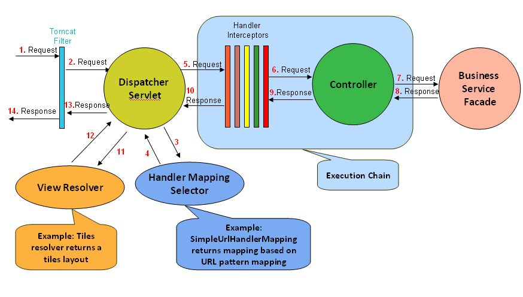

### 1. Dependency Injection에 대해서 아는대로 설명해주실래요?

접기/숨기기

우선 Dependency Injection에 대해서 설명하기 이전에 Association 관계, Dependency 관게에 대해서 설명하고 시작해야할 것 같습니다.

1️⃣ **Association Relationship**

2️⃣ **Dependency Relationship**

Association 관계의 경우 A라는 클래스가 B라는 객체를 직접 소유하는 관계를 예로 들 수 있습니다.

~~~kotlin
class A {
    private val b: B = B()
}

class B {
    ...
}
~~~

해당 Association 관계의 경우 B 객체를 A가 직접 소유하기 때문에 **둘 사이의 관계는 강하게 결합되어 있습니다.** 
다시 말하면, B의 코드가 변경되면 A로 변경이 전파될 가능성이 존재한다는 것입니다. 이는 **고수준 모듈이 저수준 모듈의 구현에 영향을 강하게 받는다는 소리이기 때문에 객체지향적으로 좋지 못합니다.**

다음으로 Dependency 관계에 대해서 설명을 하자면, A라는 클래스는 B라는 클래스의 객체를 직접 소유하는 것이 아닌, Interface 등의 **변경 가능성이 거의 없는** 것에 의존하는 것을 의미합니다.

~~~kotlin
class A {
    private lateinit var b: B
    
    constructor(b: B): this(b)
    
    ...
}

interface B {
    ...
}

class BImpl: B {
    ...
}

fun main(args: Array<String>): Unit {
    val a = A(BImpl())
}
~~~

위의 방식처럼, 실제 객체를 생성자에 선언하는 것이 아닌, 인터페이스를 생성자의 인자로 제공하여 생성자는 컴파일 시점에 Interface에 의존하고, 런타임에는 A 객체는 실제 인스턴스에 의존하게 만드는 방식입니다.

이러한 방식은 장점이 아래와 같습니다.

1. A 클래스의 로직은 B의 구현체 로직과 디커플링된다.
2. 고수준의 모듈 구현이 저수준의 모듈 구현에 덜 영향을 받게된다.
3. 전략패턴에 부합한다. 즉, 필요에 따라서 B 인터페이스를 구현하는 객체를 A에 대신 끼울수 있다는 것이다.

이는 객체지향이 지향하는 바인 OCP, DIP에 부합하게됩니다.

Spring에서 제공하는 DI의 방식은 크게 3가지인데요, 생성자 주입, 수정자 주입, 필드 주입이 있습니다. 이에 대해서는 나중에 설명을 드리겠습니다.

### 2. 일반적인 Singleton과 Spring Context에서 관리하는 Bean 사이의 차이점을 설명해주실래요?

접기/숨기기

일반적인 Singleton의 경우 구현 방식이 아래와 같습니다.

1. 생성자를 private로 설정하고 외부에서 생성자에 접근 못하게 막는다
2. 모든 로직은 synchronized 블록으로 묶는 등의 처리를 통해 thread-safe하게 만든다
3. static method인 getInstance()를 선언해서 Heap 메모리 상에 해당 인스턴스가 존재하는지 여부를 검사한 뒤 존재하면 기존 인스턴스를 반환, 존재하지 않으면 생성자를 호출하여 인스턴스를 반환한다.

그러나 싱글톤에서도 단점이 존재합니다.

1. 싱글톤은 잘못 관리하면 인스턴스가 2개가 되는 상황이 벌어질 수도 있다. 멀티스레드 환경에서 잘못 관리했을 경우이다.
2. 싱글톤 객체는 테스트에 용이하지 못하다. 왜냐하면 생성자가 private로 막혀있기 때문에 테스트 대역 생성이 곤란하기 때문이다.
3. Singleton의 모든 logic은 thread-safe하게 작성해야한다.
4. Singleton은 무상태를 기반으로 구현해야한다. 상태기반으로 Singleton을 이용하면 경합상태에 빠져서 예상치못한 동작을 일으킬 가능성이 있다.

Spring은 이러한 Singleton의 문제점을 극복하기 위해서 IoC Container를 Singleton Registry의 역할을 수행하여 Spring 차원에서 객체를 관리합니다.

이 때 IoC Container에서 관리하는 객체는 엄연히 말하면 Singleton이 아닌 일반적인 객체이지만, Spring Context 차원에서 관리가 되는 객체이기 때문에 Singleton처럼 사용이 가능합니다. 
그리고 Spring Context에서 객체들이 관리되기 때문에 Context가 이러한 Bean들의 생애주기도 결정하는 것이 가능합니다.

### 3. Spring DI/IoC는 어떠한 방식으로 동작하는가?

접기/숨기기

IoC 컨테이너는 Bean들에 대한 제어권을 사용자가 갖는 방식이 아닌, spring framework가 가지는 방식이기 때문에 해당 객체들은 모두 spring의 정책에 맞춰서 관리됩니다.

DI의 경우 주입하고자 하는 객체를 IoC Container에서 탐색하여 조건에 맞는 객체를 찾게되면 이를 주입하는 방식으로 동작합니다. 탐색 기준은 아래와 같습니다.

1. 우선 타입 기준으로 탐색한다. 타입 기준으로 검색시 정확하게 1개가 있는 경우 이를 주입한다.
2. 타입 기준으로 검색하여 1개 이상의 bean이 존재한다면, bean의 이름을 기준으로 선택하여 주입한다. bean의 이름은 클래스 이름, 혹은 메소드의 이름이 default로 설정되어있다.

그리고 이러한 Bean을 생성자 주입, 수정자 주입, 필드 주입 방식으로 DI를 수행합니다. 일반적으로 생성자 주입이 제일 많이 사용됩니다.

### 4. DI의 종류와, 왜 생성자 주입이 제일 많이 사용되는지 설명해주세요.

접기/숨기기

DI의 종류에는 3가지가 존재한다고 말씀드린 바 있습니다. 각각 간단하게 설명드리겠습니다.

1. 생성자 주입 (Constructor Injection): 생성자의 인자로 Bean을 주입하는 방식입니다. 구현 방식은 아래와 같습니다.

코드 예시

1️⃣ **Java**
~~~java
@NoArgsConstructor
@Service
public class BeamServiceImpl implements BeamService {
    private final BeamRepository beamRepository;
    
    @Override
    @Transactional
    public Bean createBeam(BeanCreateDto dto) {
        ...
    }
}
~~~

2️⃣ **Kotlin**
~~~kotlin
@Service
class BeamServiceImpl(
    private val beamRepository: BeamRepository
): BeamService {

    @Transactional
    override suspend fun createBeam(dto: BeamCreateDto) = coroutineScope {
        ...
    }
}
~~~

2. 수정자 주입 (Setter Injection): 수정자를 통해서 Bean을 주입하는 방식입니다. 주로 Test 코드에서 사용하기도 합니다.

코드 예시

1️⃣ **Java**
~~~java
@Service
public class BeamServiceImpl implements BeamService {
    private BeamRepository beamRepository;
    
    // setter
    public void setBeamRepository(BeamRepository beamRepository) {
        this.beamRepository = beamRepository;
    }
    
    @Override
    @Transactional
    public Bean createBeam(BeanCreateDto dto) {
        ...
    }
}
~~~

2️⃣ **Kotlin**
~~~kotlin
@Service
class BeamServiceImpl: BeamService {

    private var beamRepository: BeamRepository
        set(value) {
            field = value
        }

    @Transactional
    override suspend fun createBeam(dto: BeamCreateDto) = coroutineScope {
        ...
    }
}
~~~

2. 필드 주입(Field Injection): 필드를 통해 bean을 주입하는 방식입니다. @Autowired 어노테이션을 통해 bean을 탐색하여 주입합니다.

코드 예시

1️⃣ **Java**
~~~java
@Service
public class BeamServiceImpl implements BeamService {
    @Autowired
    private BeamRepository beamRepository;
    
    @Override
    @Transactional
    public Bean createBeam(BeanCreateDto dto) {
        ...
    }
}
~~~

2️⃣ **Kotlin**
~~~kotlin
@Service
class BeamServiceImpl: BeamService {

    @Autowired
    private val beamRepository: BeamRepository

    @Transactional
    override suspend fun createBeam(dto: BeamCreateDto) = coroutineScope {
        ...
    }
}
~~~

그러나 필드주입은 test 코드를 작성할 때 혹은 configuration을 작성할 때 외에는 잘 사용되지 않는 것이 현실인데요, 이유는 다음과 같습니다.

1. 필드 주입의 경우 와부에서 필드를 조작하는 것이 불가능하다. 이는 DI의 취지 중 하나였던 전략패턴의 구현 정신에 위배되는 행위이다.
2. 테스트가 곤란하다. 단위테스트를 위해서는 테스트대역을 정의해야하는데, 테스트대역 정의를 할 때 field는 조작을 할 수가 없기 때문에 테스트가 곤란한 코드를 양산하게된다.

따라서 생성자주입이 필드주입보다 훨씬 많이 사용된다.

### 5. Spring web mvc와 Dispatchers Servlet의 동작 원리에 대해서 설명해주세요.

접기/숨기기

**(그나마 제일 정확한 그림을 가져왔습니다)**

Request가 들어와서 Response가 웹서버 외부로 나갈 때 까지의 과정을 순서대로 설명드리겠습니다.

1. Request가 들어오면 우선 Servlet filter를 거친다. 이 때 filter는 Filter Chain Proxy의 형태로 구성이 되어있으며, 모든 filter를 통과하면 request는 Dispatcher Servlet으로 들어간다
2. Dispatcher Servlet은 filter를 통과한 request에 대해서 Handler Mapping에 적절한 Handler method가 존재하는지를 물어본다. 존재하는 경우 Dispatcher Servlet에 통보한다.
3. Handler Method로 보내기 전에 Request는 Interceptor를 거쳐야한다. Interceptor는 Spring context에서 관리가 되며, Controller에 들어가기 전후로 요청을 검증하는 역할을 수행한다.
4. Interceptor를 통과한 Request에 대해서 Handler Adapter를 통과하여 Handler Method에 도달한다. Handler method는 Request에 대해서 ModelAndView를 반환시킨다. 그리고 이 또한 Interceptor를 거쳐서 검증을 받아야한다.
5. Interceptor를 통과한 Response에 대하여 View가 존재하는 경우 ViewResolver로 보내지게된다. ViewResolver에 대해서는 들어온 Response에 대하여 렌더링 할 뷰가 존재하는 경우 Response와 함께 같이 렌더링하여 Dispatcher Servlet으로 보낸다.
6. 해당 View를 filter로 날려서 검증을 수행한다. filter를 통과한 Response는 비로소 웹서버를 통과하여 우리에게 Http Response로 돌아온다.

### 6. Front Controller 패턴이 무엇인지 설명해주실래요? (5번 질문의 연장선)

접기/숨기기

우선 Servlet Container가 중앙에 존재하여, Request마다 적절한 Servlet을 Servlet Container에서 생성하여 처리를 한다고 가정하겠습니다.

그러면 Request마다 적절한 Servlet이 싱글톤 인스턴스로 생성이 되어서 request, response가 적절하게 처리될것입니다. 그러나 이 방식에는 문제가 존재합니다.

1. request, response를 받아서 처리하는 거는 모든 Servlet이 공통으로 하는 부분이다. 즉, Boilerplate가 불필요하게 많이 양산된다는 것이다.
2. Request는 모두 Thread를 타고 들어오기 때문에 Servlet의 로직은 멀티쓰레드를 고려하여 작성해야한다. 즉, 구현에 어려움이 추가된다는 부분이 있다.

따라서 Spring은 위 2가지 문제점을 해결하기 위해서 Front Controller 패턴을 도입하였는데요, **request, response는 모두 Dispatcher Servlet이 맡아서 처리하고, Request는 적절한 Handler method로 매핑시키는 역할을 수행하도록 하는것입니다.**

이를 통해서 개발자는 Servlet을 직접 한땀한땀 짜는 것이 아닌, Controller, Service, Repository 등의 비지니스 로직에만 신경쓸 수 있도록 하였습니다.

### 7. Bean, Component 어노테이션에 대해서 설명해주시고, 차이점도 말씀해주세요

접기/숨기기

1. @Component: 지정된 클래스를 Application 생성 시점에 단 1회 생성하여 Singleton 객체로 IoC Container에 관리할 수 있도록 하는 어노테이션이다. @Repository, @Service, @Controller 등이 그 예시이다.
2. @Bean: 메소드에 대하여 메소드의 반환 객체를 IoC Container에 담아서 보관할 수 있게 해주는 어노테이션이다.

### 8. POJO란 무엇이고, Spring Framework 자체에서 어떠한 부분이 POJO가 될수있는지 설명해주세요. 

접기/숨기기

POJO란 코드 작성에 있어서 외부의 기술이나 환경에 영향을 받지않고 Java API 만으로 작성할 수 있게하자는 프로그래밍 정신입니다. 

이러한 POJO는 Spring에서 Controller / Service / Repository 3계층을 둚으로써 Service logic 구현부터는 Repository의 DB Acccess 로직은 블랙박스 처리를 하여 DB의 접근 기술, DB의 환경에 영향을 받지않고 Business logic을 작성할 수 있게 되는것이 대표적인 예시가 되겠습니다.

추가로 말씀드리자면, Spring Data JPA도 POJO의 정신을 잘 구현하고있다고도 생각합니다. Spring Data JPA의 경우 Database의 종류에 관계없이, 혹은 특정 db에 종속되는 dialect 설정만 해주면 DB의 기술, 종류에 구애받지 않고 일관성있게 DB Access logic을 작성할 수 있게 됩니다.

### 9. Spring AOP에 대해서 설명해주실래요? 

접기/숨기기

> 👉 **Spring AOP에 관해서는 토비의 스프링에서도 150페이지에 걸쳐서 설명하고 있습니다. 여기에 적힌 설명은 그저 요약일 뿐이며, 자세한거는 토비의 스프링 3.1을 참고해주시길 바랍니다.**

Spring AOP란 그대로 직역하자면 **관점 지향형 프로그래밍** 입니다. 우선 Spring AOP에 대해서 이해를 하기 위해서는 **관점 지향형 프로그래밍이라는 단어가 왜 등장하였는지부터 배경을 알 필요가 있습니다.**

Spring AOP를 설명하기 좋은 예시는 다름아닌 Transaction을 JDBC로 처리하는 Service logic입니다. 아래의 코드를 먼저 볼까요?

~~~kotlin
@Service
class ChatServiceImpl(
private val chatRepository: ChatRepository
): ChatService {
    override fun like(likeDto: LikeDto): Unit {
        val status = this.transactionManager.getTransaction(DefaultTransactionDefinition())
        
        try {
            ...
            this.transactionManager.commit(status)
        } catch(_: Exception) {
            this.transactionManager.rollback(status)
            throw LikeErrorException("Like Error!!")
        }
    }
}
~~~

이 코드의 문제점이라면, Service 로직을 transaction 내부에서 처리를 해야하지만, 매 로직마다 모두 transaction을 정의하고, try-catch 문으로 일괄적으로 처리를 해줘야한다는 점에 있습니다.

그렇기 때문에 가능한 보일러플레이트를 줄이기 위해서라도 transaction을 정의하는 부분 따로, 비지니스 로직을 정의하는 부분 따로 해주면 아주 좋을겁니다.

따라서 아래와 같이 분리가 가능할겁니다.

~~~kotlin
@Service
class ChatServiceImpl(
private val chatRepository: ChatRepository
): ChatService {
    override fun like(likeDto: LikeDto): Unit {
        ...
    }
}

@Service
class ChatServiceTx(
    private val chatServiceImpl: ChatService
): ChatService {
    override fun like(likeDto: LikeDto): Unit {
        val status = this.transactionManager.getTransaction(DefaultTransactionDefinition())
        
        try {
            chatServiceImpl.like(likeDto)
            this.transactionManager.commit(status)
        } catch(_: Exception) {
            this.transactionManager.rollback(status)
        }
    }
}
~~~

위와 같은 구조를 **데코레이터 패턴** 이라고 부르는데요, 일반적으로 기존의 클래스에서 부가기능을 더해주고 싶을 때 사용할 수 있는 패턴입니다.

그러나 위와 같은 방식도 문제는 있습니다. **비지니스 로직을 분리하는데는 성공했을지 몰라도, 아직도 transaction 처리를 위해서 보일러플레이트를 양산해야한다는 것입니다.**

하지만 이 문제는 객체지향적으로만 해결하기에는 한계가 있습니다. 따라서 다른 방법으로 분리를 해줘야하는데요, 이 때 사용할 수 있는 방식이 **Dynamic Proxy** 입니다.

Dynamic Proxy는 **Java Reflection을 기반으로 동적으로 프록시를 생성하여 기존의 메소드에 부가기능을 더해줄 수 있다는 특징을 가집니다.**

그러나 Dynamic Proxy 방식은 하나의 문제점이 있는데, **런타임에 동적으로 생성이 되는 객체이기 때문에 특별한 방법을 거치지 않는 이상 IoC Container에 Bean으로 등록할 수 없다는 점에 있습니다.**

이를 위해서 Proxy Factory Bean이라는 것을 Spring에서 제공을 해주지만, 이 또한 타겟 오브젝트와 Proxy Factory Bean이 1대1 관계를 맺어야하기 때문에 xml을 계속 작성해줘야한다는 **개발 피로** 를 유발합니다.

Spring은 이를 해소하기 위해서 지금까지 설명해온 개념들을 모두 혼합하여 Spring AOP라는 것을 개발하였습니다. 

* Advice: 메소드에 부여할 추가 기능을 정의한 오브젝트
* JoinPoint: 메소드에 부여되는 추가 기능이 개입하는 시점을 정의한 오브젝트
* PointCut: 메소드의 시그니처를 이용해서 타켓 메소드를 지정하는데 사용하는 오브젝트

이를 통해서 개발자는 동적으로 프록시를 생성하거나, 혹은 팩토리 프록시 빈을 작성할 필요 없이 Spring AOP를 활용하여 간단하게 부가기능을 정의할 수 있게됩니다.

그리고 이러한 Spring AOP의 대표는, 다름아닌 @Transactional 어노테이션인데요, 개발자는 이 어노테이션만 붙임으로써 비지니스 로직에 트랜잭션을 정의할 수 있게됩니다.

### 10. Spring AOP가 적용이 안되는 경우가 있다면 설명해주시고, 이 때는 어떻게 해야하는지 간단하게 설명만 해주세요. 

접기/숨기기

Spring AOP는 Java Reflection 기반으로 구현된 기술이기 때문에 **메소드만을 타겟팅할 수 있습니다.** 즉, 메소드 외에 다른것이 타겟이거나, 혹은 리플렉션으로 커버가 안되는 로직에 대해서는 Spring AOP로 해결이 불가능하다는 뜻입니다.

이러한 경우 해결방법은, **AspectJ** 를 사용하는 것입니다. AspectJ는 클래스를 바이트코드 단위로 뜯어서 부가기능을 추가하는 것이 가능합니다.

하지만 개발하면서 AspectJ까지 활용하면서 부가기능을 더할 일은 거의 없기 때문에, 이렇구나 정도만 알고 지나가셔도 무방합니다.

👉 **8월 18일 추가 사항**: AOP의 적용 대상이 아닌 메소드에서 AOP 적용 대상의 메소드를 호출하려고 시도하면 해당 AOP가 적용되지 않는 현상도 존재한다고 한다. 자세한건 아래 링크를 찹고하면 되겠습니다!

[Spring AOP를 사용시 주의할 점](https://velog.io/@18k7102dy/Spring-AOP-Spring-AOP%EB%A5%BC-%EC%82%AC%EC%9A%A9%EC%8B%9C-%EC%A3%BC%EC%9D%98%ED%95%B4%EC%95%BC%ED%95%A0-%EC%A0%90)

