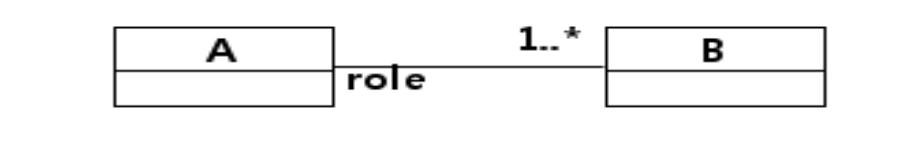
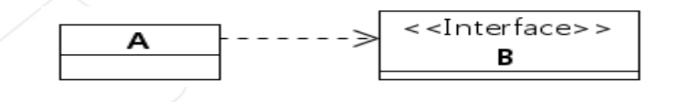

### 1. Dependency Injection에 대해서 아는대로 설명해주실래요?

접기/숨기기

우선 Dependency Injection에 대해서 설명하기 이전에 Association 관계, Dependency 관게에 대해서 설명하고 시작해야할 것 같습니다.

1️⃣ **Association Relationship**

2️⃣ **Dependency Relationship**

Association 관계의 경우 A라는 클래스가 B라는 객체를 직접 소유하는 관계를 예로 들 수 있습니다.

~~~kotlin
class A {
    private val b: B = B()
}

class B {
    ...
}
~~~

해당 Association 관계의 경우 B 객체를 A가 직접 소유하기 때문에 **둘 사이의 관계는 강하게 결합되어 있습니다.** 
다시 말하면, B의 코드가 변경되면 A로 변경이 전파될 가능성이 존재한다는 것입니다. 이는 **고수준 모듈이 저수준 모듈의 구현에 영향을 강하게 받는다는 소리이기 때문에 객체지향적으로 좋지 못합니다.**

다음으로 Dependency 관계에 대해서 설명을 하자면, A라는 클래스는 B라는 클래스의 객체를 직접 소유하는 것이 아닌, Interface 등의 **변경 가능성이 거의 없는** 것에 의존하는 것을 의미합니다.

~~~kotlin
class A {
    private lateinit var b: B
    
    constructor(b: B): this(b)
    
    ...
}

interface B {
    ...
}

class BImpl: B {
    ...
}

fun main(args: Array<String>): Unit {
    val a = A(BImpl())
}
~~~

위의 방식처럼, 실제 객체를 생성자에 선언하는 것이 아닌, 인터페이스를 생성자의 인자로 제공하여 생성자는 컴파일 시점에 Interface에 의존하고, 런타임에는 A 객체는 실제 인스턴스에 의존하게 만드는 방식입니다.

이러한 방식은 장점이 아래와 같습니다.

1. A 클래스의 로직은 B의 구현체 로직과 디커플링된다.
2. 고수준의 모듈 구현이 저수준의 모듈 구현에 덜 영향을 받게된다.
3. 전략패턴에 부합한다. 즉, 필요에 따라서 B 인터페이스를 구현하는 객체를 A에 대신 끼울수 있다는 것이다.

이는 객체지향이 지향하는 바인 OCP, DIP에 부합하게됩니다.

Spring에서 제공하는 DI의 방식은 크게 3가지인데요, 생성자 주입, 수정자 주입, 필드 주입이 있습니다. 이에 대해서는 나중에 설명을 드리겠습니다.

### 2. 일반적인 Singleton과 Spring Context에서 관리하는 Bean 사이의 차이점을 설명해주실래요?

접기/숨기기

일반적인 Singleton의 경우 구현 방식이 아래와 같습니다.

1. 생성자를 private로 설정하고 외부에서 생성자에 접근 못하게 막는다
2. 모든 로직은 synchronized 블록으로 묶는 등의 처리를 통해 thread-safe하게 만든다
3. static method인 getInstance()를 선언해서 Heap 메모리 상에 해당 인스턴스가 존재하는지 여부를 검사한 뒤 존재하면 기존 인스턴스를 반환, 존재하지 않으면 생성자를 호출하여 인스턴스를 반환한다.

그러나 싱글톤에서도 단점이 존재합니다.

1. 싱글톤은 잘못 관리하면 인스턴스가 2개가 되는 상황이 벌어질 수도 있다. 멀티스레드 환경에서 잘못 관리했을 경우이다.
2. 싱글톤 객체는 테스트에 용이하지 못하다. 왜냐하면 생성자가 private로 막혀있기 때문에 테스트 대역 생성이 곤란하기 때문이다.
3. Singleton의 모든 logic은 thread-safe하게 작성해야한다.
4. Singleton은 무상태를 기반으로 구현해야한다. 상태기반으로 Singleton을 이용하면 경합상태에 빠져서 예상치못한 동작을 일으킬 가능성이 있다.

Spring은 이러한 Singleton의 문제점을 극복하기 위해서 IoC Container를 Singleton Registry의 역할을 수행하여 Spring 차원에서 객체를 관리합니다.

이 때 IoC Container에서 관리하는 객체는 엄연히 말하면 Singleton이 아닌 일반적인 객체이지만, Spring Context 차원에서 관리가 되는 객체이기 때문에 Singleton처럼 사용이 가능합니다. 
그리고 Spring Context에서 객체들이 관리되기 때문에 Context가 이러한 Bean들의 생애주기도 결정하는 것이 가능합니다.

### 3. Spring DI/IoC는 어떠한 방식으로 동작하는가?

접기/숨기기

IoC 컨테이너는 Bean들에 대한 제어권을 사용자가 갖는 방식이 아닌, spring framework가 가지는 방식이기 때문에 해당 객체들은 모두 spring의 정책에 맞춰서 관리됩니다.

DI의 경우 주입하고자 하는 객체를 IoC Container에서 탐색하여 조건에 맞는 객체를 찾게되면 이를 주입하는 방식으로 동작합니다. 탐색 기준은 아래와 같습니다.

1. 우선 타입 기준으로 탐색한다. 타입 기준으로 검색시 정확하게 1개가 있는 경우 이를 주입한다.
2. 타입 기준으로 검색하여 1개 이상의 bean이 존재한다면, bean의 이름을 기준으로 선택하여 주입한다. bean의 이름은 클래스 이름, 혹은 메소드의 이름이 default로 설정되어있다.

그리고 이러한 Bean을 생성자 주입, 수정자 주입, 필드 주입 방식으로 DI를 수행합니다. 일반적으로 생성자 주입이 제일 많이 사용됩니다.

### 4. DI의 종류와, 왜 생성자 주입이 제일 많이 사용되는지 설명해주세요.

접기/숨기기

DI의 종류에는 3가지가 존재한다고 말씀드린 바 있습니다. 각각 간단하게 설명드리겠습니다.

1. 생성자 주입 (Constructor Injection): 생성자의 인자로 Bean을 주입하는 방식입니다. 구현 방식은 아래와 같습니다.

코드 예시

1️⃣ **Java**
~~~java
@NoArgsConstructor
@Service
public class BeamServiceImpl implements BeamService {
    private final BeamRepository beamRepository;
    
    @Override
    @Transactional
    public Bean createBeam(BeanCreateDto dto) {
        ...
    }
}
~~~

2️⃣ **Kotlin**
~~~kotlin
@Service
class BeamServiceImpl(
    private val beamRepository: BeamRepository
): BeamService {

    @Transactional
    override suspend fun createBeam(dto: BeamCreateDto) = coroutineScope {
        ...
    }
}
~~~

2. 수정자 주입 (Setter Injection): 수정자를 통해서 Bean을 주입하는 방식입니다. 주로 Test 코드에서 사용하기도 합니다.

코드 예시

1️⃣ **Java**
~~~java
@Service
public class BeamServiceImpl implements BeamService {
    private BeamRepository beamRepository;
    
    // setter
    public void setBeamRepository(BeamRepository beamRepository) {
        this.beamRepository = beamRepository;
    }
    
    @Override
    @Transactional
    public Bean createBeam(BeanCreateDto dto) {
        ...
    }
}
~~~

2️⃣ **Kotlin**
~~~kotlin
@Service
class BeamServiceImpl: BeamService {

    private var beamRepository: BeamRepository
        set(value) {
            field = value
        }

    @Transactional
    override suspend fun createBeam(dto: BeamCreateDto) = coroutineScope {
        ...
    }
}
~~~

2. 필드 주입(Field Injection): 필드를 통해 bean을 주입하는 방식입니다. @Autowired 어노테이션을 통해 bean을 탐색하여 주입합니다.

코드 예시

1️⃣ **Java**
~~~java
@Service
public class BeamServiceImpl implements BeamService {
    @Autowired
    private BeamRepository beamRepository;
    
    @Override
    @Transactional
    public Bean createBeam(BeanCreateDto dto) {
        ...
    }
}
~~~

2️⃣ **Kotlin**
~~~kotlin
@Service
class BeamServiceImpl: BeamService {

    @Autowired
    private val beamRepository: BeamRepository

    @Transactional
    override suspend fun createBeam(dto: BeamCreateDto) = coroutineScope {
        ...
    }
}
~~~

그러나 필드주입은 test 코드를 작성할 때 혹은 configuration을 작성할 때 외에는 잘 사용되지 않는 것이 현실인데요, 이유는 다음과 같습니다.

1. 필드 주입의 경우 와부에서 필드를 조작하는 것이 불가능하다. 이는 DI의 취지 중 하나였던 전략패턴의 구현 정신에 위배되는 행위이다.
2. 테스트가 곤란하다. 단위테스트를 위해서는 테스트대역을 정의해야하는데, 테스트대역 정의를 할 때 field는 조작을 할 수가 없기 때문에 테스트가 곤란한 코드를 양산하게된다.

따라서 생성자주입이 필드주입보다 훨씬 많이 사용된다.

### 5. Spring web mvc와 Dispatchers Servlet의 동작 원리에 대해서 설명해주세요.

접기/숨기기

